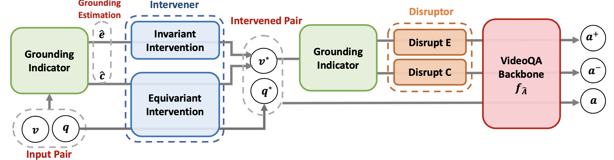

<h2 align="center">
Equivariant and Invariant Grounding for Video Question Answering 🔥
</h2>

<div align="center">

[](https://arxiv.org/pdf/2207.12783.pdf)
[](https://github.com/yl3800/EIGV) 
<!-- [](https://youtu.be/wJhR9_dcsaM)  -->
</div>

## Overview 
This repo contains source code for **Equivariant and Invariant Grounding for Video Question Answering**. We present EIGV — a model-agnostic explainer, that empowers the SoTA VideoQA model with better explainabilty and performance. In the light of the causality, we formulate our learning principles causal-equivariance and environment-invariance by incorporating three constituents, the grounding indicator, the intervener, and the disruptor, which manage a robust rationale discovery. Experiments across three benchmarks validate EIGV’s fulfillment in both interpretation and accuracy.
<p align="center">
    < </center>
</p>

## Installation
- Main packages: PyTorch = 1.11 
- See `requirements.txt` for other packages.

## Data Preparation
We use NExT-QA as an example to help get farmiliar with the code. Please download the dataset and the pre-computed features from [here](https://github.com/doc-doc/NExT-QA)

After downloading the data, please modify your data path and feature path accordingly.

## Run EIGV
Simply run `train.py` to reproduce the results in the paper. We have saved our checkpoint [here](https://drive.google.com/file/d/1JNcD_nFHzYdjtwy8bMH8vshXyAzrNkZ0/view?usp=sharing) (acc 53.72% on NExT-QA) for your references.

## Reference 
```
@misc{https://doi.org/10.48550/arxiv.2207.12783,
  author = {Li, Yicong and Wang, Xiang and Xiao, Junbin and Chua, Tat-Seng},
  title = {Equivariant and Invariant Grounding for Video Question Answering},
  publisher = {arXiv},
  year = {2022},
  copyright = {Creative Commons Attribution Non Commercial No Derivatives 4.0 International}
}

```

## Acknowledgement
Our reproduction of the methods is based on the respective official repositories and [NExT-QA](https://github.com/doc-doc/NExT-OE), we thank the authors to release their code.
